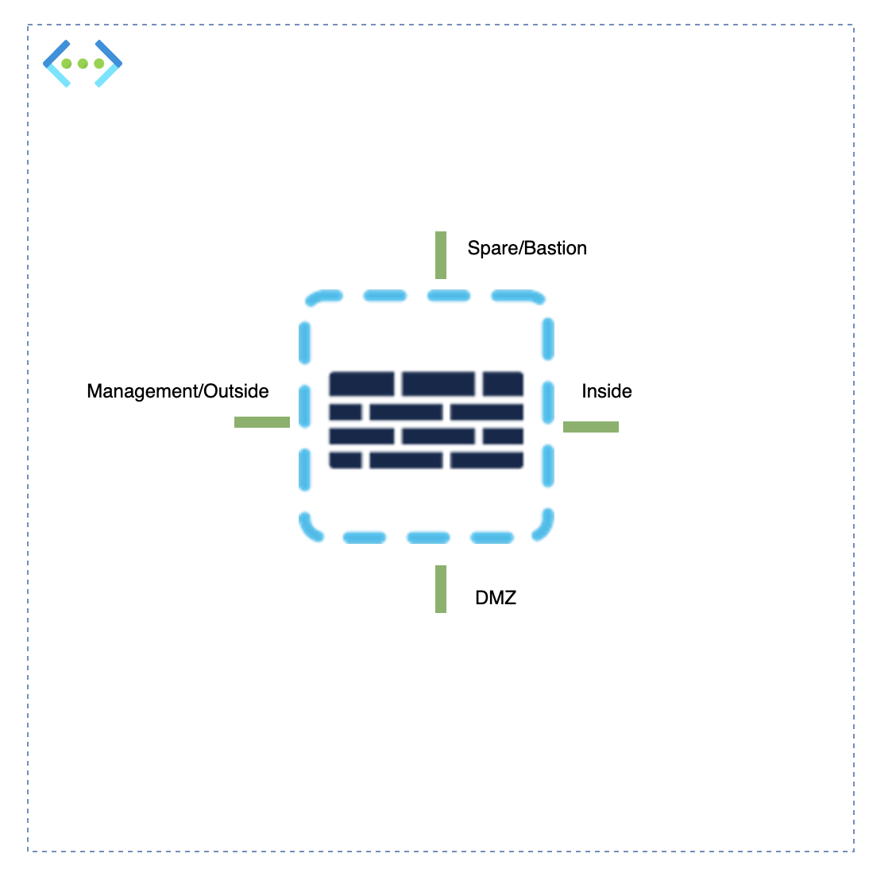

### Terraform Template to create Single Instance of ASAv in a single location.

## Network Topology 




## Preinstallation

First step is to set up the Linux server to install Terrraform and Azure CLI.

- Install Terraform on Ubuntu : [Doc](https://www.terraform.io/docs/cli/install/apt.html)

- Install Azure CLI on Ubuntu : [Doc](https://docs.microsoft.com/en-us/cli/azure/install-azure-cli-linux?pivots=apt)

Make sure to login to Azure using below command to use Azure as a provider in Terraform template

`az login --use-device-code`

The template has been tested on :

- Terraform Version =  0.14.7
- Hashicorp AzureRM Provider = 2.56.0

Using this Terraform template, one instance of ASA will be deployed in Azure based on the user requirement.

- one new VPC with four subnets (1 Management networks, 3 data networks)
- Routing table attachment to each of these subnets.
- Public IP attachment to the Management subnet.

The variables should be defined with a value in the "terraform. tfvars" file before using the templates.

### Variables

| Variable | Meaning |
| --- | --- |
| `location = "centraleurope"` | Resorce group Location in Azure |
| `prefix = "cisco-ASAv"` | This would prefix all the component with this string |
| `source-address = "*"` | Limit the Management access to specific source IPs |
| `IPAddressPrefix = "10.10"` | All the IP Address segment will use this as prefix with .0,.1,.2 and .3 as the 3rd octet |
| `Version = "915.1.1"` | ASA Version to be deployed - Please validate the correct version using - `az vm image list --offer asav --all` |\
| `VMSize = "Standard_D3_v2"` | Size of the ASAv to be deployed |
| `RGName = "cisco-ASAv-RG"` | Resource Group Name |
| `instancename = "cisco-ASAv"` | Instance Name and properties of ASAv |
| `username = "cisco"` | Username to login to ASA |
| `password = "P@$$w0rd1234"` | Password to login to ASA |

## Deployment Procedure

1) Clone or Download the Repository
2) Input the values in the terraform ".tfvars" for variables in .tf
3) Initialize the providers and modules

    ```asa
     - go to the specific terraform folder from the cli 
        cd xxxx
        terraform init 
    ```

4) submit the terraform plan

    ```asa
       terraform plan -out <filename>
    ```

5) verify the output of the plan in the terminal; if everything is fine, then apply the plan

    ```asa
        terraform apply <out filename generated earlier>
    ```

6) Check the output and confirm it by typing "yes."

## Post Deployment Procedure

1) SSH to the instance by using ssh cisco@PublicIP

2) configure each of the interface based on the subnet the interface belongs to

    An example is attached below,

    ```asa
        !
        interface GigabitEthernet0/0
        no shutdown
        nameif spare
        security-level 0
        ip address dhcp
        !
        interface GigabitEthernet0/1
        no shutdown
        nameif inside
        security-level 100
        ip address dhcp
        !
        !
        interface GigabitEthernet0/2
        no shutdown
        nameif dmz
        security-level 50
        ip address dhcp
        !
    ```

3) Configure ACL to the outside interface

    ```asa
        access-list testacl extended permit ip any any
        access-group testacl in interface management
        !
    ```

ASAv are deployed and are protecting the server segment. 
